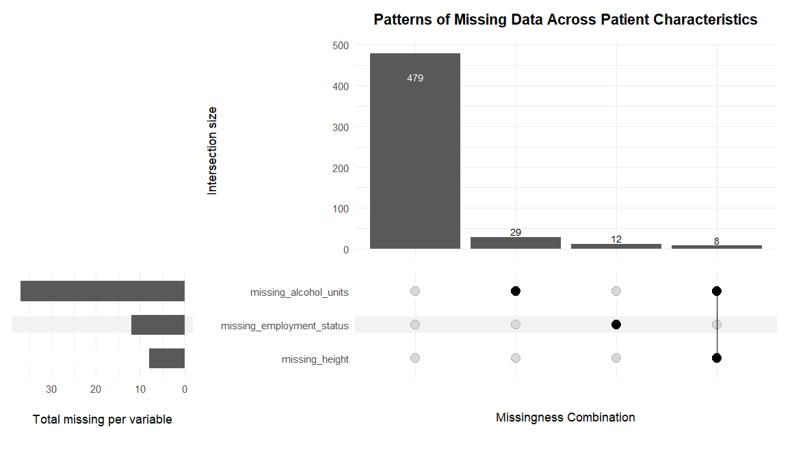
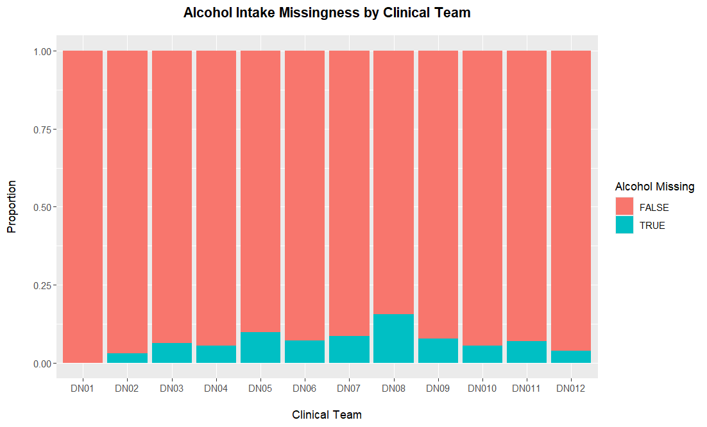
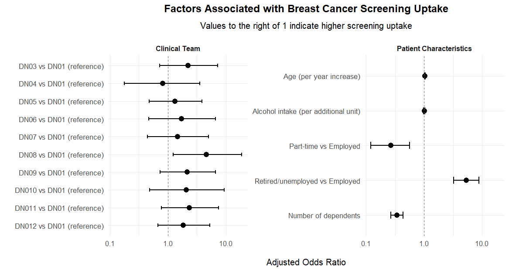

# Breast Cancer Screening Statistical Analysis


Reproducible statistical analysis of patient-level healthcare data to identify factors associated with **breast cancer screening uptake**.

This project demonstrates a full **data analysis workflow in R**, including:

- data discovery
- data cleaning and harmonisation
- data validation
- exploratory data analysis
- statistical modelling
- interpretation of clinical findings

---

# Project Overview

Breast cancer screening programmes play a critical role in early detection and improved patient outcomes. However, participation rates vary across populations and healthcare settings.

This project analyses patient-level data from multiple clinical teams to investigate whether demographic and behavioural characteristics are associated with a patient's decision to attend breast cancer screening.

The analysis aims to:

- evaluate factors associated with breast cancer screening attendance
- assess patterns of missing data
- examine whether patient populations differ across clinical teams
- identify independent predictors of screening uptake using a multivariable logistic regression model while accounting for variation between clinical teams

---

# Research Question

**Which patient characteristics are associated with breast cancer screening attendance?**

---

# Dataset Description

The dataset consists of **528 patient records collected across 12 clinical teams**.

Each observation includes the following variables:

| Variable | Description |
|--------|-------------|
| Age | Patient age (years) |
| Weight | Body weight (kg) |
| Height | Height (meters) |
| Alcohol intake | Weekly alcohol consumption (units) |
| Employment status | Employment category |
| Number of dependents | Number of dependents |
| Screening decision | Whether the patient accepted screening (Yes/No) |
| Clinical team | Identifier of the clinical team |

The `clinical_team` variable was added during data preparation to indicate the source dataset after merging the 12 individual clinical team files.

Some variables contain missing values, which were analysed to assess potential patterns and bias.

Overall, **91% of patients had complete data across all variables**.

---

# Analysis Pipeline

The analysis follows a structured and reproducible workflow:

Raw Data → Data Cleaning → Validation → Exploratory Analysis → Logistic Regression → Interpretation

---

### 1. Data Discovery
Initial inspection of the raw datasets to assess:

- variable structure
- missing values
- duplicated records
- summary statistics

### 2. Data Cleaning and Harmonisation

Data from 12 separate datasets were cleaned and merged into a single analysis dataset.

Steps included:

- standardising variable names
- converting measurement units
- harmonising data types
- ensuring consistent dataset structure

### 3. Data Validation

Validation checks ensured data integrity:

- duplicate record detection
- missing data assessment
- plausibility checks for numeric variables

### 4. Exploratory Data Analysis

Exploratory analyses examined:

- patterns of missing data
- variation in patient characteristics across clinical teams
- screening participation rates

### 5. Statistical Modelling

A **multivariable logistic regression model** was used to assess independent predictors of screening attendance while adjusting for clinical team.

Model diagnostics included assessment of:

- multicollinearity
- model stability
- sensitivity analysis with additional covariates

---

# Results and Visualisations

## Missing Data Patterns



The UpSet plot illustrates patterns of missing data across patient characteristics.

Most observations contain complete data (**479 of 528 patients**). Missing values occur primarily in:

- alcohol intake (7.0%)
- employment status (2.3%)
- height (1.5%)

Missingness was largely confined to **single variables with minimal overlap**, suggesting isolated recording omissions rather than systematic data loss.

---

## Alcohol Intake Missingness by Clinical Team



This figure shows the proportion of missing alcohol intake values across clinical teams.

Missingness was generally low across teams and did not appear systematically associated with screening decisions. This supports the assumption that missing alcohol intake values were unlikely to introduce major bias into the analysis.

---

## Factors Associated with Breast Cancer Screening Uptake



The forest plot displays **adjusted odds ratios from the multivariable logistic regression model**.

Values to the right of 1 indicate a higher likelihood of attending screening.

Key findings include:

**Age**

Older patients were slightly more likely to attend screening.  
Each additional year of age increased the odds of screening attendance by approximately **4% (OR 1.04, 95% CI 1.02–1.06)**.

**Employment Status**

Compared with full-time employment:

- **Part-time workers had substantially lower odds of screening attendance (OR 0.27)**.
- **Retired or unemployed individuals had higher odds of screening attendance (OR 5.30)**.

**Number of Dependents**

Each additional dependent was associated with **reduced screening uptake (OR 0.34)**.

**Alcohol Intake**

Alcohol consumption was **not independently associated with screening attendance**.

**Clinical Teams**

After adjusting for patient characteristics, most differences between clinical teams were attenuated. Only one team (DN08) showed significantly higher screening uptake compared with the reference team (DN01).

---

# Interpretation

The results suggest that **practical and social factors may influence screening participation**.

Patients with greater family responsibilities or work commitments appeared less likely to attend screening. In contrast, individuals with fewer time constraints, such as retired patients, showed higher participation.

These findings highlight the importance of considering **accessibility and social barriers** when designing screening programmes.

Potential strategies to improve screening uptake may include:

- extended clinic hours
- workplace-based screening initiatives
- targeted outreach to groups with lower participation rates

---

# Repository Structure
```
breast-cancer-screening-statistical-analysis
│
├── raw_data
│ └── Original datasets (csv files)
│
├── scripts
│ ├── 01_data_discovery.R
│ ├── 02_data_cleaning.R
│ ├── 03_validation.R
│ ├── 04_exploratory_data_analysis.R
│ ├── 05_statistical_modelling.R
│ └── breast_cancer_screening_analysis.Rmd
│
├── output
│ └── Generated figures
│
├── report
│ └── Final analysis report and appendix
│
└── breast_cancer_screening_analysis.Rproj
```
---

# Technologies Used

The analysis was conducted using the following computational environment:

- **R** (version 4.5.2)
- **RStudio** (version 2026.01.0+392)
- **Operating System:** Windows 10 x64

### Main R Packages

| Package | Version | Purpose |
|-------|--------|--------|
| tidyverse | 2.0.0 | Data manipulation, transformation, and visualisation |
| naniar | 1.1.0 | Missing data exploration and visualisation |
| ComplexUpset | 1.3.3 | Visualisation of missing data patterns |
| effectsize | 1.0.1 | Calculation of statistical effect sizes |
| binom | 1.1.1.1 | Binomial confidence intervals |
| broom | 1.0.12 | Tidying model outputs |
| scales | 1.4.0 | Plot formatting and scaling |
| janitor | 2.2.1 | Data cleaning utilities |
| skimr | 2.2.2 | Structured dataset summaries |
| car | 3.1.5 | Regression diagnostics (Variance Inflation Factor) |
| sessioninfo | 1.2.3 | Recording session and package information |

---

# Reproducibility

**Clone the repository:**

```bash
git clone https://github.com/NikolaosSamperis/breast-cancer-screening-statistical-analysis.git
```
**Open the R project:**
```
breast_cancer_screening_analysis.Rproj
```
**Run scripts in the following order:**

```
scripts/01_data_discovery.R
scripts/02_data_cleaning.R
scripts/03_validation.R
scripts/04_exploratory_data_analysis.R
scripts/05_statistical_modelling.R
```

## Author

**Nikolaos Samperis**  
MSc Applied Bioinformatics  
King’s College London  

---

## Disclaimer

This repository is intended for demonstration purposes to showcase statistical analysis and reproducible research workflows.

The dataset used in this project is a **synthetic dataset created for analytical assessment purposes** and does not represent real patient data.

---

## License

This project is licensed under the **Apache License 2.0**.

See the [LICENSE](LICENSE) file for details.
